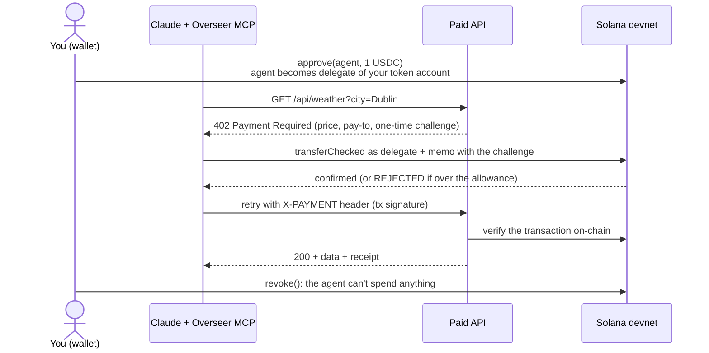

# ApiSift

**An API agent for developers: it finds the APIs your project needs and pays for them per call, within spending limits enforced by Solana.**

The codebase and MCP tools still use the working name *Overseer*.

Built at BUILD IRL Vol. 1 (Solana hackathon, Dublin, 26 Sept 2026).

## The idea in 30 seconds

**Problem.** AI agents increasingly need to pay for things like APIs, data and compute. Today you either give an agent your card (no per-agent limit, and it can't pay fractions of a cent) or you prepay every vendor separately.

**Overseer.** You give your agent (Claude) a USDC allowance, say $1. The agent pays for services on its own, but:
- **Solana enforces the limit**, not our code: the agent can only spend through the allowance.
- **You can revoke it** with one click.
- **Every payment is public** and linked on Solana Explorer.
- **Payments of $0.01 or less work**, because fees on Solana are tiny.

**Why it needs Solana.** The limit is enforced by the SPL Token program, which is built into Solana. The agent's code can't get around it, and there's no bank or company in the middle that you have to trust.

**The demo moment.** Claude buys weather data for $0.01 (we show the transaction on Explorer). Then it tries to buy something that costs more than its remaining allowance, and **the blockchain rejects the payment live on stage**. Then we press revoke, and the agent is cut off.

## How it works



The key trick: the agent never holds your money. It is a **delegate** on your token account, a native SPL Token feature (`approve` / `revoke`). The Token program keeps track of how much allowance is left and rejects any transfer above it. The agent deliberately sends payments without checking the allowance itself, so an overspend becomes a **failed transaction you can open on Explorer**, which proves the chain blocked it.

The payment flow follows the [x402](https://solana.com/x402) pattern (HTTP 402 + stablecoin payment + retry with proof).

## Status

| Part | What it does | Status |
|---|---|---|
| `src/scripts` | One-command devnet setup, test USDC, funding, approve / revoke / status from the command line | ✅ Done |
| `src/api` | Paid API: 402 offers, on-chain payment check, weather service ($0.01) | ✅ Done |
| `src/agent` | Agent wallet, paying `fetch`, MCP server for Claude, CLI demo | ✅ Done |
| `web/` | **ApiSift web app**: Projects (each with its own budget, agent and allowance), project detail with live feed, API Analyzer page | ✅ Built, tested against the API; not yet reviewed in a browser by the team |
| `src/api/office.ts` | **Office API** behind the web app: projects, allowances, repo analysis (demo wallet, localhost only) | ✅ Done, tested on devnet |
| `src/api/services.ts` | **API analyzer** paid service (0.25 USDC): structured outputs over a curated catalog, refunds on failure | 🟡 Needs a workspace-scoped Anthropic key (see Troubleshooting) |
| Demo run-through, prompts, backup recording | | 🔲 Task C |
| Pitch deck (**.pptx only**) | | 🔲 Task D |

## Work split

Put your name next to a task in the team chat before starting.

### Task A: Dashboard (`web/`), about 3h, frontend
The "you" side of the demo. It's what judges look at while Claude spends.
- Vite + React + TypeScript, with [`@solana/wallet-adapter-react`](https://github.com/anza-xyz/wallet-adapter) (Phantom / Solflare on **devnet**).
- **Read config** from `web/src/overseer.json`. `npm run setup` writes it: mint, decimals, agent, merchant, owner, RPC URL, API URL. The file only contains public addresses.
- **Allowance card:** remaining allowance and your test USDC balance. Read them from your token account with `getAccount()`, using its `delegate` and `delegatedAmount` fields.
- **Set allowance:** an amount input that sends `createApproveCheckedInstruction(tokenAccount, mint, agent, wallet, amount, decimals)` through the wallet.
- **Revoke button:** sends `createRevokeInstruction(tokenAccount, wallet)`.
- **Live activity feed:** poll `getSignaturesForAddress(tokenAccount)` every ~3 s and parse the transactions. Show rows for *allowance set*, *paid X USDC for …* (the memo holds the description), **blocked by Solana** (failed transactions), and *revoked*. Each row links to Explorer. Cache parsed transactions, because the public RPC is rate-limited.
- Show a warning if the connected wallet isn't the `owner` the agent spends from, with the fix: `npm run fund -- <address>`.
- Gotcha: `@solana/web3.js` needs a `Buffer` polyfill in the browser. Use the `buffer` package and set `globalThis.Buffer` before anything else runs.
- **Done when:** in the browser you can approve 0.05, watch the agent's payments appear, see a blocked payment show up in red, and revoke.

### Task B: API analyzer (premium paid service), about 2h, backend + LLM
A paid service Claude can buy through Overseer. It also gives the demo its "too expensive" moment.
- **Endpoint:** `POST /api/analyze`, priced at about **0.25 USDC**. Add it as a `Service` in [`src/api/services.ts`](src/api/services.ts); listing and paywall come automatically.
- **Input:** `{ "prompt": "what we're building", "projectTree"?: "…", "readme"?: "…" }`.
- **Output:** existing service APIs that fit the project's scope and goals. For each: name, what it does, why it fits, pricing and auth notes, docs URL, and whether an agent could pay for it per request (x402).
- **Implementation:** the Claude API (add `ANTHROPIC_API_KEY` to `.env`), optionally grounded in a small curated catalog to cut hallucinated APIs.
- Use `validate()` to reject empty input **before** payment is requested, so bad requests are never charged.
- **Demo:** allowance $0.10, so weather ($0.01) goes through, then the analyzer ($0.25) is **blocked by the chain**. Top up the allowance in the dashboard, and it goes through.
- **Done when:** in Claude Code, "Analyze this repo and find APIs we could use; pay with Overseer" returns useful recommendations and a receipt.

### Task C: Demo and Claude integration, about 1h plus rehearsal
- Walk through the whole flow on the demo laptop (see [Try it](#try-it)).
- Write the exact prompts for the live demo.
- Record a backup screen recording in case the Wi-Fi or devnet fails on stage.
- Collect Explorer links and screenshots for the deck.

### Task D: Pitch deck (start now, runs all day)
- **Only `.pptx` is accepted.** If you use Gamma, Canva or Pitch, test the export early.
- The pitch is **3 minutes**. Judges score the **idea, feasibility, and how big it could get**.
- Suggested slides: problem → solution and how it works → how Solana is used → demo → potential and next steps → team.
- **Don't invent** stats, users or partners. Label anything unconfirmed as an assumption.
- Submit at **tally.so/r/rj7oqN**. Ask the organisers for the exact deadline.

**Nice-to-haves, only if there's time:** a Helius devnet RPC URL for reliability, a per-day limit (would need our own Solana program, so it's a good next-steps slide), and switching to the official x402 SDK.

## Getting started

**You need:** Node.js 22+. For the dashboard, a browser wallet on devnet: Phantom (Settings → Developer Settings → Testnet mode → Solana Devnet) or Solflare (network: devnet).

```bash
npm install
cp .env.example .env        # optional; the defaults use the public devnet RPC
npm run setup
```

`npm run setup` creates your devnet keys in `keys/`, a **test USDC** token (6 decimals, made by us, no real value), token accounts, and SOL for fees. It's safe to re-run. **If the airdrop fails** (the devnet faucet is rate-limited, which is common), it prints an admin address. Send it SOL at https://faucet.solana.com (devnet) and run `npm run setup` again.

Each developer gets their own keys and test token. `keys/` and `.overseer/` are gitignored, so **never commit them**.

## Try it

**Terminal 1**, the paid API:
```bash
npm run api
```

**Terminal 2**, the agent paying from the command line with the built-in test wallet:
```bash
npm run approve -- 0.015   # allowance: 0.015 USDC
npm run demo               # pays 0.01 for Dublin weather: OK, with an Explorer link
npm run demo               # 0.005 left < 0.01: BLOCKED by the Token program, failed tx on Explorer
npm run revoke             # the agent is cut off
npm run status             # allowance, balances, agent SOL for fees
```

**With Claude Code:** open this folder in Claude Code and approve the `overseer` MCP server when asked. It's configured in [`.mcp.json`](.mcp.json). Keep `npm run api` running, then ask something like:

> What's the weather in Dublin right now? Use a paid service through Overseer and show me the receipt.

Claude gets three tools: `overseer_status`, `overseer_list_services`, and `overseer_paid_fetch`.

**The ApiSift web app**, terminal 3:
```bash
npm run web      # http://localhost:5173
```
- **Projects** (`#/projects`): the office. Create a project and it gets its own agent key and its own budget account on Solana. Every project's allowance is a separate on-chain limit.
- **Project page** (`#/projects/<id>`): set or revoke the allowance (signed by the demo wallet), the agent and budget accounts, the `.mcp.json` snippet that points Claude at this project, and the live activity feed.
- **API Analyzer** (`#/analyzer`): paste a public GitHub repo link and pick a project. ApiSift reads the repo for free, then the project's agent pays 0.25 USDC over x402 and Claude recommends APIs from the catalog. If the project's allowance is too small, Solana blocks the payment; if the analysis fails after payment, the money is refunded.

The web app uses the built-in **demo wallet** (`keys/owner.json`), so no browser wallet is needed. Its office API only answers requests from the same machine.

**Point Claude at a project:** add `"env": { "APISIFT_PROJECT": "<project id>" }` to the `overseer` server in `.mcp.json`, or tell Claude which project to use (the MCP tools take a `project` parameter).

## Commands

| Command | What it does |
|---|---|
| `npm run setup` | One-time devnet setup (re-runnable) |
| `npm run fund -- <address\|test> [usdc]` | Give a wallet test USDC + SOL and make it the owner the agent spends from (`test` = the built-in test wallet) |
| `npm run approve -- <usdc>` | Set the agent's allowance from the test wallet |
| `npm run revoke` | Revoke the allowance from the test wallet |
| `npm run status` | Show allowance, balances, and the agent's SOL for fees |
| `npm run api` | Start the paid API on http://localhost:4020 |
| `npm run demo -- [city]` | The agent buys weather data from the command line |
| `npm run mcp` | Start the MCP server by hand (Claude Code starts it for you) |
| `npm run web` | Start the ApiSift web app on http://localhost:5173 |
| `npm run typecheck` | Type-check the backend and the dashboard |

## Project structure

```
.mcp.json                 Claude Code config for the Overseer MCP server
bin/overseer-mcp.sh       MCP launcher (also finds Node in ~/.local/node)
src/
  lib/
    config.ts             .env, paths, local state (.overseer/state.json, web/src/overseer.json)
    projects.ts           ApiSift projects (.overseer/projects.json): agent key + budget account each
    solana.ts             RPC connection, keypairs, memo, explorer links, amount helpers
    x402.ts               402 / X-PAYMENT message shapes
  agent/
    wallet.ts             pays as a delegate; explains on-chain rejections
    paidFetch.ts          fetch() that settles 402 responses from the allowance
    mcp.ts                MCP server: overseer_status / _list_services / _paid_fetch
    demo.ts               CLI demo
  api/
    server.ts             Express server + /api/services catalog
    payments.ts           paywall middleware + on-chain payment check
    services.ts           paid services (add new ones here): weather, analyzer
    apiCatalog.ts         curated APIs the analyzer can recommend
    office.ts             web app backend: projects, allowances, repo analysis (demo wallet)
    github.ts             reads a public repo: metadata, file tree, README, dependency manifest
  scripts/                setup, fund, approve, revoke, status
web/                      ApiSift web app (Vite + React)
  src/App.tsx             shell, navigation, routes (#/projects, #/projects/<id>, #/analyzer)
  src/pages/              Projects, ProjectDetail, Analyzer
  src/api.ts              office API client + hash router
  src/overseer.ts         activity feed: reads a budget account's history from devnet
  src/overseer.json       addresses written by setup (gitignored)
```

## Solana terms used here

- **Devnet:** Solana's free test network. Test SOL and our test USDC have no real value.
- **Mint:** the address that defines a token. Ours is a test USDC we created in setup.
- **Token account:** holds one person's balance of one token.
- **Delegate / allowance:** a token account's owner can `approve` another key to spend up to N tokens and `revoke` that at any time. The **Token program** enforces it. This is Overseer's core.
- **Memo:** a note attached to a transaction. We use it for the one-time payment challenge and a readable description.
- **Explorer:** https://explorer.solana.com/?cluster=devnet, where anyone can inspect accounts and transactions.
- **x402:** a standard for paying for web resources with HTTP 402 plus stablecoins, built for AI agents.

## Known limitations (good material for "next steps")

- The allowance is **one total cap**, not per day or per vendor, and a token account can only have one delegate at a time. Per-day or per-vendor rules would need our own Solana program or a smart-wallet protocol.
- Our 402 flow follows x402, but **the agent submits the transaction itself** instead of using an x402 facilitator, because it pays as a delegate of someone else's account.
- Test USDC is our own devnet token, so wallets show it as an unknown token.
- The paid API keeps payment challenges and used transactions **in memory**. Restarting it clears them.
- The public devnet RPC is rate-limited. Put a free [Helius](https://www.helius.dev/) devnet URL in `RPC_URL` for the demo.
- The web app signs with a **demo wallet held by the server**. A real product would sign in the user's wallet (Phantom etc.).
- A refund returns the money but not the allowance: the Token program already used up that part of the delegation, so set the allowance again.
- The analyzer only recommends APIs from `src/api/apiCatalog.ts`, which is small. GitHub allows 60 unauthenticated API calls an hour per IP; set `GITHUB_TOKEN` in `.env` if you hit that.

## Troubleshooting

- **`429 Too Many Requests`:** the public RPC or faucet is rate-limited. Wait a bit, or use a Helius devnet `RPC_URL`.
- **Claude Code doesn't show the tools:** check that `npm install` ran and the server is approved (`/mcp` in Claude Code). The launcher needs `node` on PATH or in `~/.local/node/bin`.
- **Analyzer says "This API key is not scoped to a workspace":** use an Anthropic key created inside a workspace, or add `ANTHROPIC_WORKSPACE_ID=<id>` to `.env` and restart `npm run api`. Paid calls that fail this way are refunded automatically.
- **The web app says the API isn't reachable:** start it with `npm run api` (port 4020).
